# Parcel Digitization and Validation
In update_form_e1_demarcation.sql, parcels are moved from the update schema to the public schema when they have been checked. Part of this process, however, is done in QGIS, as parcels are only moved when the “checked” column of manual_digitization or form_e1_parcels is set to ‘yes’. We georeference and check parcels in these two layers in the a QGIS project titled 'monitoring_tool', then we change the “checked” attribute of that parcel to ‘yes’, and when the update_form_e1_demarcation.sql script is run, those parcels are moved into the parcels layer, located on the public schema. You’ll find an overview of all these layers below.

## Validating Villages (Socially and Geospatially)
- Consult with the chief to get a village list.
    - This is initially a paper list from the chief, which is then loaded as choices into the 'A1 Village Identification' form.
- Enumerators will go out with an ODK Collect set up, and collect points and document the area the villages are in as well as some other identifying details.
    - Enumerators will also collect additional villages that they come across.
    - Sometimes villages identified by the chief are not found, or enumerators find them to be empty or abandoned.
- If this is the case, then the data needs to be validated by checking for:
    - Different spellings: confim with chief/village/indunas.
    - Duplicates:
        - Did enumerators accidentally collect the same village twice?
            - This may be actually collecting twice from the same location or maybe two people vying to be the headperson. Bring this information to the chief for clarification.
        - Calculate distance between duplicate villages, and evaluate if they are far enough to be two distinct villages.
    - 'New' villages.
    - Too many villages.
        - This happens when the ‘village center’ is the area/settlement where the headperson lives.
- After villages are validated (either in Access of QGIS), and the chief approves the final list, the villages need to be assigned unique village IDs.
- Once villages are identified and validated, the process of demarcating parcels and customary land tenure can begin.

## GIS Layers
- update.form_e1_parcels: Parcels are inserted here if the enumerator recorded a full or partial boundary area, once they are marked as checked, they are moved to public.parcels.
- public.form_e1_demarcation: Data from form E1, points are lat-long of the demarcation point recorded in the form.
- manual_digitization: Parcels are manually digitized in this layer when the enumerator has recorded hand drawn boundaries only, once they are digitized and checked, they move to public.parcels.
- public.parcels: Checked parcels from update.form_e1_parcels and from update.manual_digitization.
    - **_this is the most accurate and validated parcel layer_**

## Georeferencing Guide
You’ll need several layers loaded onto the [monitoring_tool QGIS project](MonitoringTools.html), if they aren’t there already. (See instructions on how to add layers with a postGIS database connection in the monitoring_tools documentation):
- form_e1_demarcation: points located within each parcel, and **_contains images of hand drawn maps_**
- manual_digitization
- form_e1_parcels
- Google Satellite Basemap

#### **For parcels in manual_digitization (no boundaries drawn):**
- Using the boundary_image tool, click on the form_e1_demarcation point located within the boundary you wish to digitize (it should be located on the toolbar on the top of the QGIS window).

- A browser window will open and you’ll be prompted to log into the server to view the images attached to the point, one of these images should be the map sheet image, which will have the drawn boundaries you need to check or digitize.
- With Google satellite loaded as the base layer, it is sometimes really clear to see the parcel boundaries on QGIS and the map sheet image.
    - When this is the case, you can immediately use the add polygon feature tool without georeferencing.
- Highlight the manual digitization layer in the layers panel and hit the edit pencil, then click on the add polygon feature icon.

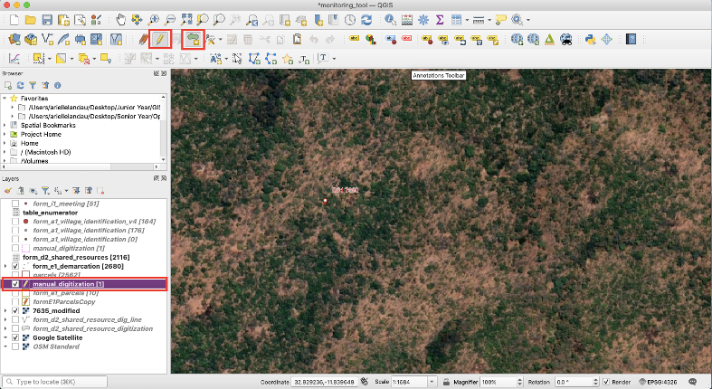
- Draw the parcel boundary. Pnce complete, right click and then enter the parcel's ID and the parcel name.
- **If the boundary is not immediately clear (err on the side of caution), you need to use the georeferencer tool**
- First you need to navigate back to the browser window where you opened the image from the form_e1_demarcation layer using the boundary_image tool. Save the image and name it after the parcel id.

    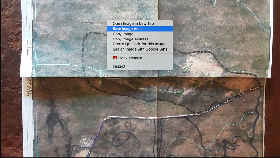
- Navigate to the georeferencer tool, found under Raster > Georeferencer.

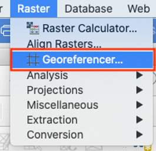
- The Georeferencer window should pop up, to add the image, click on the grid icon in the top left corner.

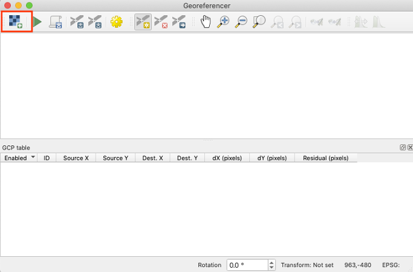
- Navigate to where you saved the image of the parcel, then click open, the image should load in the center of the window.

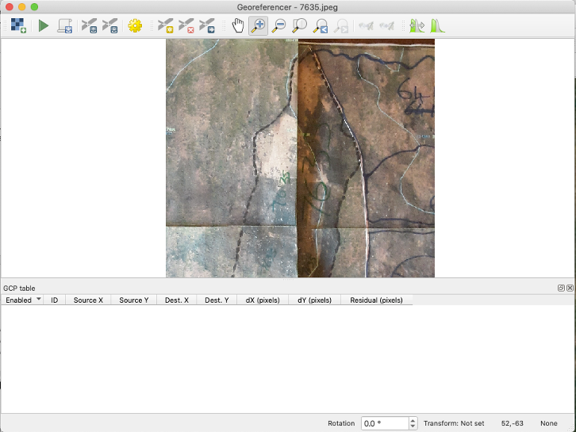
- Now we need to add points to the image and reference them to points in the main QGIS window. Start by clicking on the add points tool.

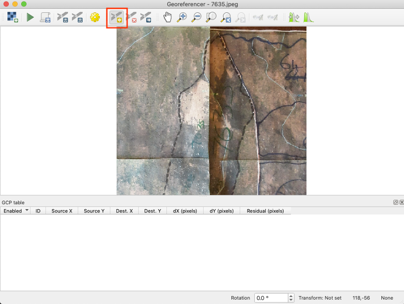
- Click a point on the image that should be easy to find, such as where roads intersect, where land use changes, bodies of water, etc.
    - Once you click on the image, a window will pop up, you can either enter map coordinates, or select the same point in the main QGIS window/ map canvas, we want ‘From Map Canvas’.

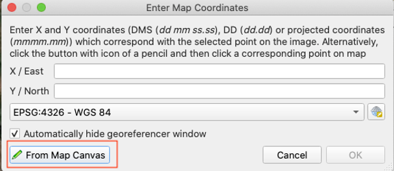
- Select the same location in the map canvas.

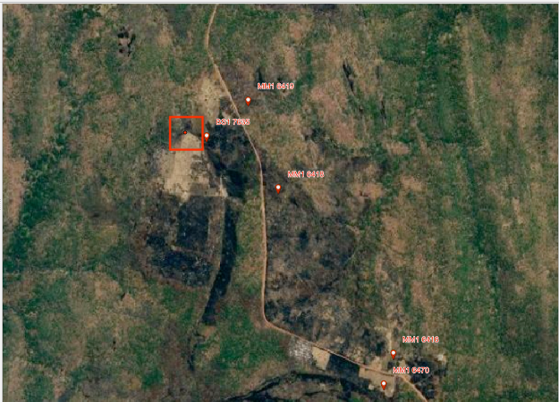
- Then hit ok in the 'Enter Map Coordinates' window.

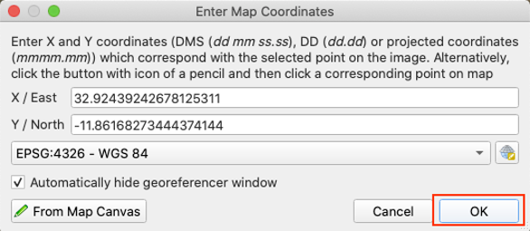
- The georeferencer window will then pop up again, and you should see the point on the image, and a new feature in the table at the bottom of the window.

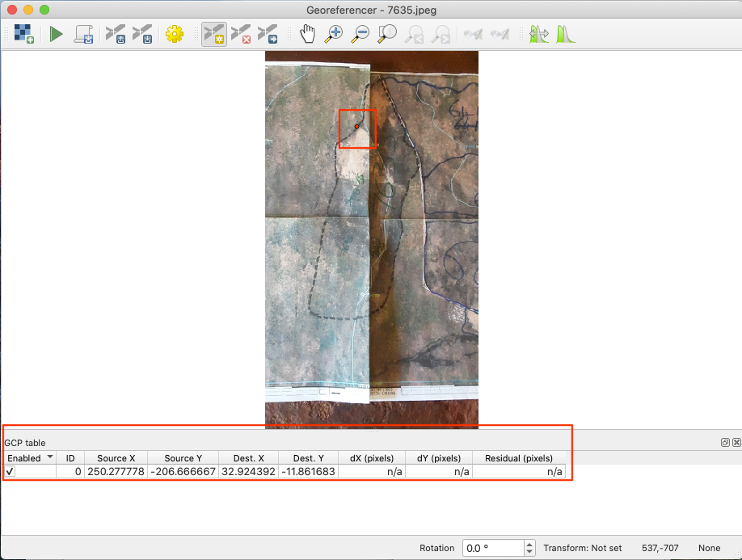
- Repeat the process until you have enough points, the more points you have, the more accurate the georeferenced image will be, you should have at least six well-spaced points.
    - Then navigate to transformation settings.

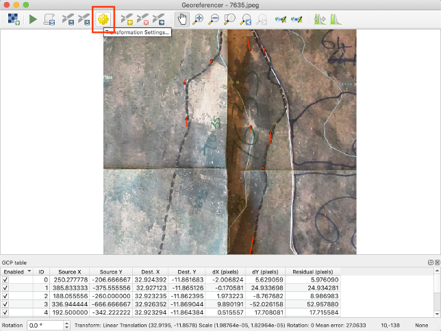
- Set your transformation settings to 'Linear', you can name the output raster whatever you would like but you should associate the name with the parcel number or name.

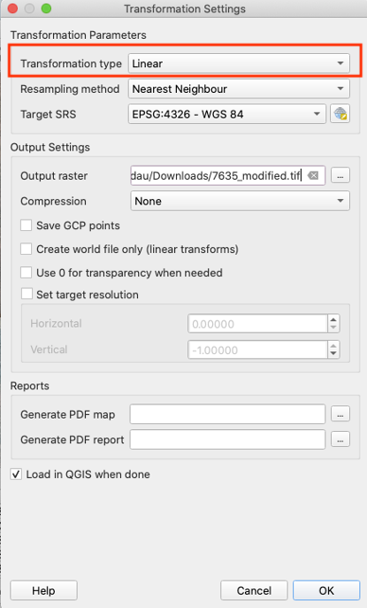

- Hit OK, you should see your georeferenced image as a raster layer in the main QGIS window.
    - If the image looks really wonky, try a different transformation settings until the image matches up well with the google satellite background.

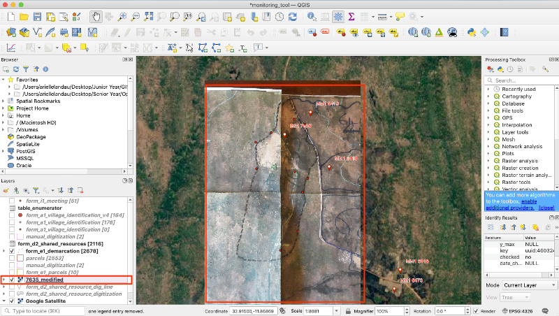
- Highlight the manual_digitization layer, then put the layer in edit mode by clicking on the pencil icon, and then the 'add polygon feature' icon.

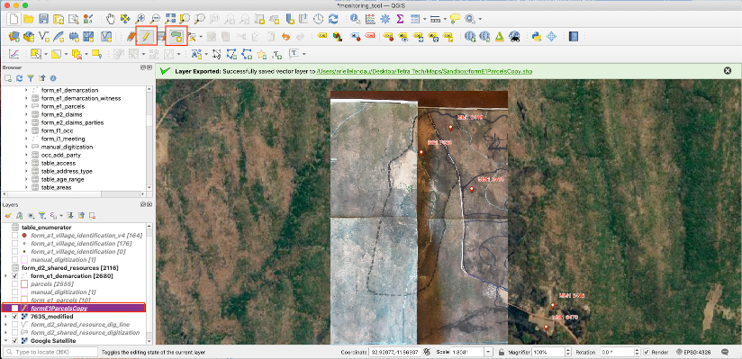
- Trace the parcel boundary and then right click to finalize it, then in the window that pops up enter the parcel’s id and the parcel name. Then you can uncheck the raster image and see your georeferenced and digitized boundary.

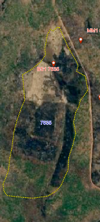
- Someone else should check your digitized parcel boundary, once this is done, open the manual_digitization attribute table, click the edit pencil, and change the ‘checked’ field to ‘yes’ and fill out the date checked field with the current date.

#### **For parcels in form_e1_parcels (some or all boundaries drawn):**
- Using the boundary_image tool, click on the form_e1_demarcation point located within the boundary you wish to digitize (it should be located on the toolbar on the top of the QGIS window).

- A browser window will open and you’ll be prompted to log into the server to view the images attached to the point, one of these images should be the map sheet image, which will have the drawn boundaries you need to check or digitize.
- **If the boundary is fully drawn**, all you need to do is check the drawn boundary against the map sheet image. If everything looks good, change the ‘checked’ column in form_e1_parcels to ‘yes’ by opening the layers attribute table and hitting the edit pencil.
- **If the boundary is partly drawn**, you need to edit the boundary:
    - With Google satellite loaded as the base layer, it is sometimes really clear to see the parcel boundaries on QGIS and the map sheet image, if the boundary is not clear, you need to use the georeferencer tool, you can follow the instructions on how to georeference that are listed above.
    - Select the boundary you want to finish drawing with the ‘select features by area’ tool, put form_e1_parcels in editing mode by clicking on the yellow pencil icon.

- To add the boundary, click on Edit > Edit Geometry > Add Part, complete the polygon, and then right click once you have finished the boundary.

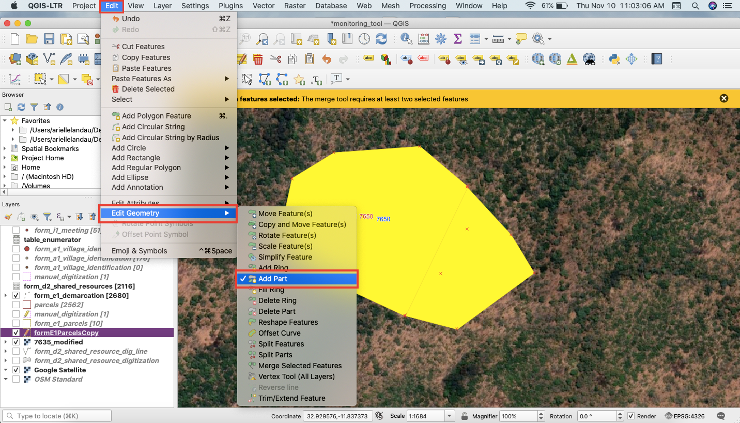
- Open the attribute table and change the 'checked' attribute to 'yes'.

After this process, parcels should be validated and on the public schema. The next section goes over a monitoring tool and error spotter in excel to see the progress towards digitization and validation of parcels and parties.

**[Previous](MonitoringTools.html) <> [Next](Monitoring_Data_Excel.html)**
