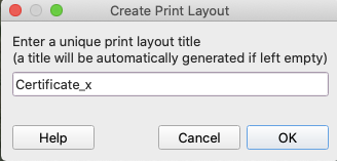
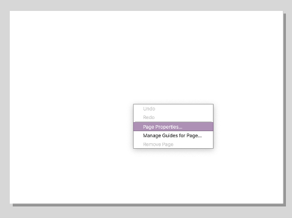
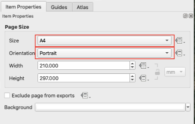
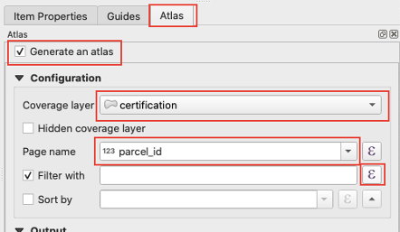
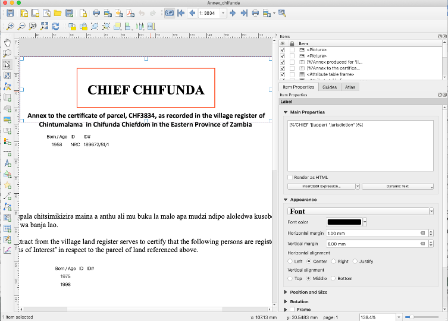
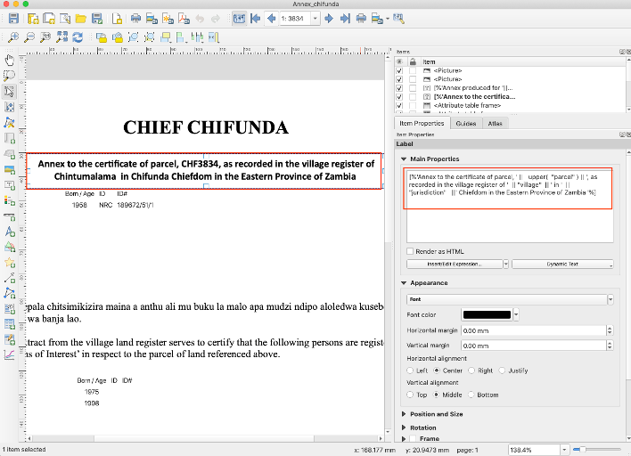
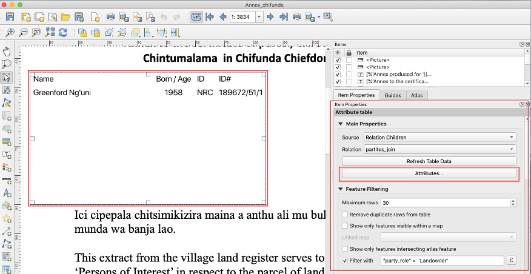
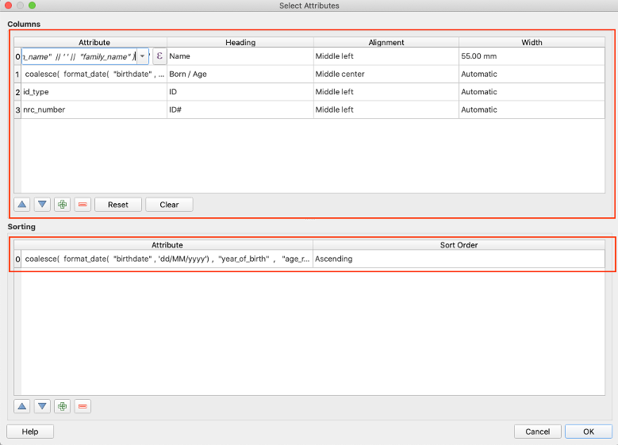
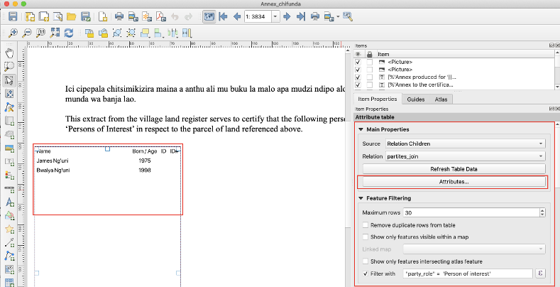

# Parcel Certificate Annex

### Set Up QGIS Print Layout
- We will use the same instructions as when we set up the Certificate print layout.
- Go to 'Project' > 'New Print Layout'.


- Name the layout Certificate_x, where x is the chiefdom.
    - ex: Certificate_chikwa


- Right click on the empty panel and hit 'Page Properties'.


- Set the size of the page to 'A4' and the Orientation to 'Portrait'.


- On the side panel, go to 'Atlas', and then check 'Generate an atlas'.
    - Under configuration set the fields to the following:
        - Coverage layer: `certification`
        - Page name: `parcel_id`
- Click the check box next to 'Filter with', then click on the expression icon.


- In the pop up window, enter the following expression: `dem_zone = x`, where x is a different zone, as we want a different print layout for each chiefdom.
    - in the example below, `dem_zone = 'Zone 15'`, then click ok.


- Check the box next to 'Sort by', then click on the expression icon and set the field to `village||parcel`, then click ok.


### Heading
- Use the 'Add Label' tool with the expression ``` [%'CHIEF '||upper( "jurisdiction" )%] ```
    - example output: CHIEF CHIFUNDA



### Subheading
- Use the 'Add Label' tool with the expression: ``` [%'Annex to the certificate of parcel, ' || upper( "parcel" ) || ', as recorded in the village register of ' || "village" || ' in ' || "jurisdiction" ||' Chiefdom in the Eastern Province of Zambia '%] ```
    - example output: Annex to the certificate of parcel, CHF3834, as recorded in the village register of Chintumalama in Chifunda in the Eastern Province of Zambia



### Parties Information
- Use the 'Add Attribute Table' tool and click and drag to create the table.
- Set the following in the 'Item Properties' panel:
    - Source: Relation Children
        - This relation was set up in a previous step.
    - Relation: parties_join
    - Filter with: ``` "party_role" = 'Landowner' ```


- Click on 'Attributes', then configure the table and sorting as follows:


| Attribute | Heading | Alignment | Width |
| --- | --- | --- | --- |
| ```if( "middle_name" != '',"given_name" ||' '||  "middle_name"  || ' '||  "family_name", "given_name"  || ' ' ||  "family_name" )``` | Name | Middle left | 55.00 mm |
| ```coalesce(  format_date(  "birthdate" , 'dd/MM/yyyy') ,  "year_of_birth"  ,   "age_range")``` | Born/Age | Middle center | Automatic |
| id_type | ID | Middle left | Automatic |
| nrc_number | ID# | Middle left | Automatic |

- Configure sorting:

| Attribute | Sort Order |
| --- | --- |
| ```coalesce(  format_date(  "birthdate" , 'dd/MM/yyyy') ,  "year_of_birth"  ,   "age_range")``` | Ascending |


- Then click 'OK'.

### Main Text
- Use the 'Add Label' tool with the following text:
'Ici cipepala chitsimikizira maina a anthu ali mu buku la malo apa mudzi ndipo aloledwa kusebenzetsa munda wa banja lao.

This extract from the village land register serves to certify that the following persons are registered as ‘Persons of Interest’ in respect to the parcel of land referenced above.’

### Persons of Interest Table
- Use the 'Add Attribute Table' tool and set the following 'Main Properties'.
    - Source: Relation Children
    - Relation: parties_join
    - Filter with: ``` "party_role" = 'Person of interest' ```


- Click on 'Attributes', then configure the table and sorting as follows:


| Attribute | Heading | Alignment | Width |
| --- | --- | --- | --- |
| ```if( "middle_name" != '',"given_name" ||' '||  "middle_name"  || ' '||  "family_name", "given_name"  || ' ' ||  "family_name" )``` | Name | Middle left | 55.00 mm |
| ```coalesce(  format_date(  "birthdate" , 'dd/MM/yyyy') ,  "year_of_birth"  ,   "age_range")``` | Born/Age | Middle center | Automatic |
| id_type | ID | Middle left | Automatic |
| nrc_number | ID# | Middle left | Automatic |

- Configure sorting:

| Attribute | Sort Order |
| --- | --- |
| ```coalesce(  format_date(  "birthdate" , 'dd/MM/yyyy') ,  "year_of_birth"  ,   "age_range")``` | Ascending |

### Footer
- Use the 'Add Label' tool with the following text:


Notes:
1. A Person of Interest is someone who has been identified by the landholder(s) as someone who has a legitimate claim, in terms of customary norms and practises in the chiefdom, to inherit the customary land right to the referenced parcel, either partially or in its entirety.
2. Additional Persons of Interest may be added to the village register at any time, by the landholder(s) of a particular parcel.
3. All landholders that are registered as joint landholders of a particular parcel must agree to the addition of Persons of Interest in respect to that parcel.
4. Any person can make a request to view the village or chiefdom land register at any time, which request is made to the Land Committee/Land Secretariat.
5. Any landholder in the village may make a request to the Land Committee/Land Secretariat for an updated extract of the village land register in respect to a parcel registered in their name.

Cidziwitso:
1. ‘Person of Interest’ ndi munthu amene wasankhidwa ndi mwini munda kutengako mbali pakusebenzetsa munda uja.
2. Anthu otengako mbali pakusebenzetsa munda angaonjezdwe pa mndandanda wa maina nthawi ina ili yonse ndi eni munda.
3. Anthu omwe analembetsa minda yao kukhala awiri kapena atatu (Joint holders) mwakulingana mphamvu pakagwiritsidwe ka malo, ayenela kugwirizana pakusankha anthu amene azatengako mbali pa munda wao.
4. Munthu wina aliyense angathe kutenga cilolezo kucokera ku bungwe la malo apa mudzi kapena kwa amfumu apa mudzi ngati afuna kuona mu buku la malo.
5. Mwini malo a m’mudzi angathe kupempha cilolezo kucokera ku kabungwe kamalo apa mudzi kapena kwa mfumu yapa mudzi ngati afuna kuona zosinthidwa mu buku ya malo.


### Production Note
- Use the 'Add Label' tool with the following expression: ``` [%'Annex produced for '||'Chief '|| "jurisdiction" ||' by '|| 'North Luangwa Conservation Programme' ||' '|| format_date( now(),'dd-MM-yyyy')%] ```
    - example output: Annex produced for Chief Chifunda by North Luangwa Conservation Programme 06-12-2022


**[Previous](Main_Certificate.html) <> [Next](/Pages/ZCLAS/ZCLAS_Intro.html)**
