# Parcel Certificates
- Certificate production is set up so that each parcel that has gone through the complete OCC (Objection, Correction and Confirmation) process has a certificate.
    - Each parcel has its own certificate, configured by the Atlas tool in QGIS.
    - The Atlas tool allows for queries in the print layout to bring each parcel's unique data onto the certificate.

### Set Up QGIS Project for Certificate Production
- [certification.sql](../General_Assets/certification.sql)
    - Cleans the data: sets the certified attribute to ‘certify’ in public.form_f1_occ
    - Inserts parcels into public.certification with data from form_e2_claims, parcels, form_f1_occ, form_e1_demarcation (all on the public schema) when there is data for that parcel in all of those layers.
    - Calculates the size of the parcel as well as the min and max of the horizontal and vertical axis for each parcel, these values are used later in order to automate certificate production.
- Load the following layers from the public schema onto a QGIS project:
    - certification
    - form_e1_demarcation
    - form_e2_claims_parties
    - Google Satellite base layer

### Add Relation to Project
- This relation will be used later to configure the attribute tables in the certificates.
- Go to 'Project' > 'Project Properties' and then click on the 'Relations' tab. Then click on 'Add Relation'.

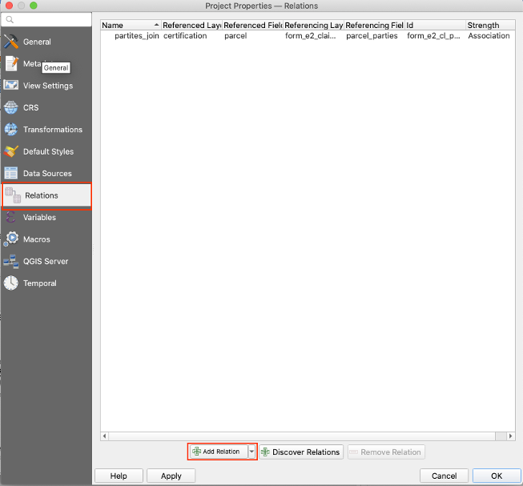
- Configure the relation as follows:
    - Name: parties_join
    - Relationship strength: Association
    - Layer and fields mapping:
        - Referenced (parent)
            - Layer: certification
            - Field 1: parcel
        - Referencing (child)
            - Layer: form_e2_claims_parties
            - Field 1: parcel_parties

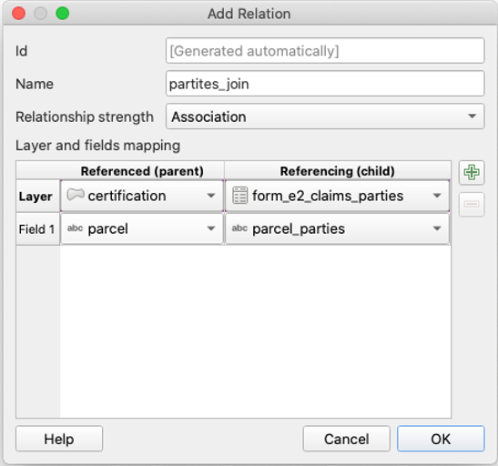

### Configure the Atlas
- Go to 'Project' > 'New Print Layout'.

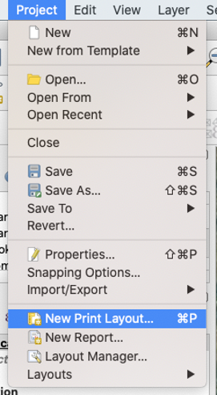
- Name the layout Certificate_x, where x is the chiefdom.
    - For example: Certificate_chikwa


- Right click on the empty panel and hit 'Page Properties'.


- Set the size of the page to 'A4' and the Orientation to 'Portrait'.


- On the side panel, go to 'Atlas', and then check 'Generate an atlas'.
    - Under configuration set the fields to the following:
        - Coverage layer: `certification`
        - Page name: `parcel_id`
- Click the check box next to 'Filter with', then click on the expression icon.


- In the pop up window, enter the following expression: `dem_zone = x`, where x is a different zone, as we want a different print layout for each chiefdom.
    - in the example below, `dem_zone = 'Zone 15'`, then click ok.

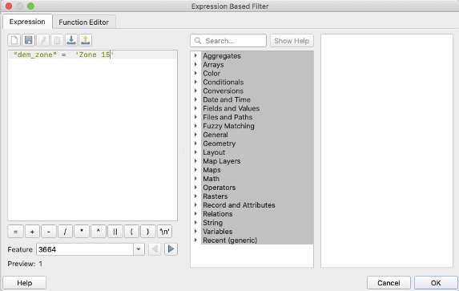
- Check the box next to 'Sort by', then click on the expression icon and set the field to `village||parcel`, then click ok.

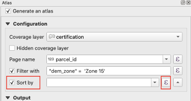
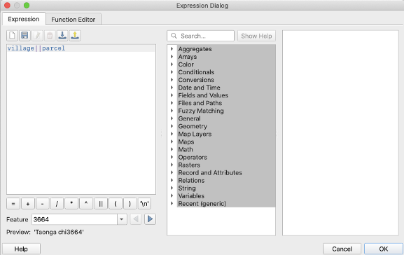

### Heading

#### Title
- Use the 'Add Label' tool, then add a top heading of the Chief followed by their jurisdiction, in large green letters.


- Expression: ``` [% 'CHIEF '||upper("jurisdiction")%] ```, example output: 'Chief Chikwa'

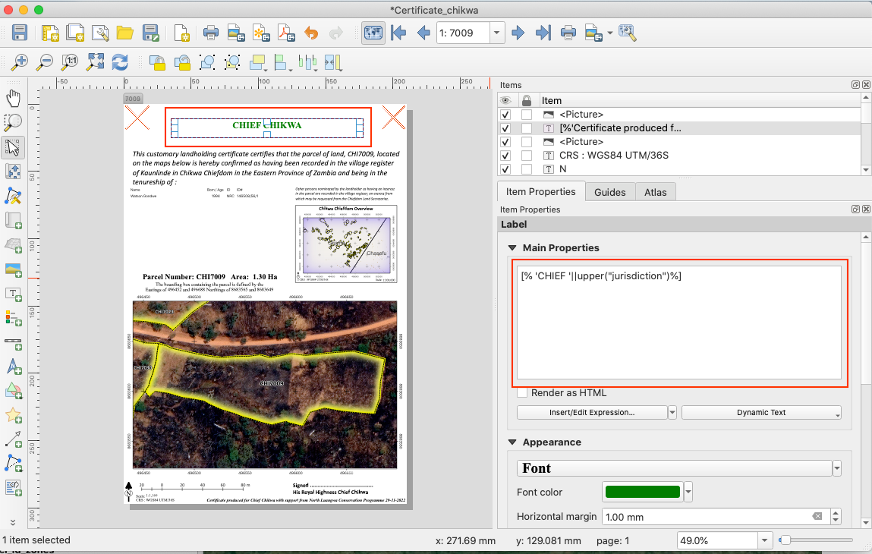

#### Subtitle
- Use the 'Add Label' tool again.
- Expression: ``` : [%'This customary landholding certificate certifies that the parcel of land, ' || upper( "parcel" ) || ', located on the maps below is hereby confirmed as having been recorded in the village register of ' || "village" || 'in ' || "jurisdiction" ||' Chiefdom in the Eastern Province of Zambia and being in the tenureship of : '%] ```
    - Example output: This customary landholding certificate certifies that the parcel of land, CHI7009, located on the maps below is hereby confirmed as having been recorded in the village register of Kaunlinde in Chikwa Chiefdom in the Eastern Province of Zambia and being in the tenureship of:

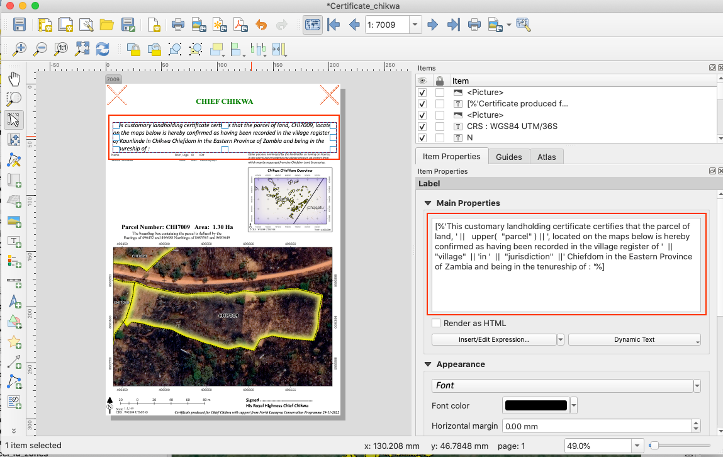

### Parties Information Table
- Use the ‘Add Attribute Table’ tool, select the tool, and then click and drag the general shape of the table, the table should rest below the subtitle, but leave room on the right side for the chiefdom map.

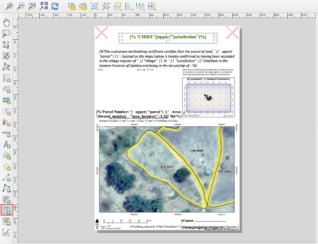
- In the ‘Item Properties’ panel on the right side of the window, set the following in the Main Properties of the Attribute table. The source and relation information comes from earlier when we added a relation to the project.  
    - Source: Relation Children
    - Relation: parties_join
    - Click the check box next to 'Filter with', and in the expression panel set the expression to: ``` “party_role” = ‘Landowner’ ```
- Then click on 'Attributes...'

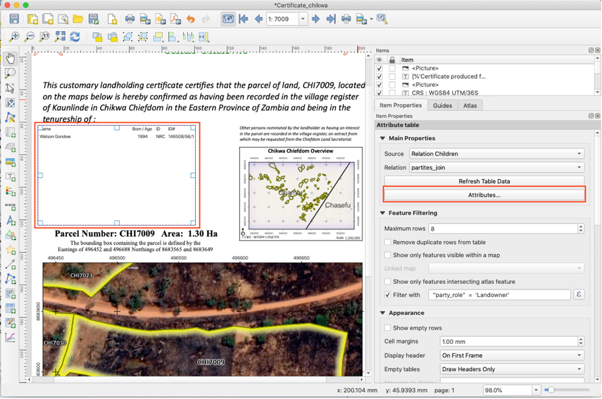
- Configure table:

| Attribute | Heading | Alignment | Width |
| --- | --- | --- | --- |
| ```if( "middle_name" != '',"given_name" ||' '||  "middle_name"  || ' '||  "family_name", "given_name"  || ' ' ||  "family_name" )``` | Name | Middle left | 55.00 mm |
| ```coalesce(  format_date(  "birthdate" , 'dd/MM/yyyy') ,  "year_of_birth"  ,   "age_range")``` | Born/Age | Middle center | Automatic |
| id_type | ID | Middle left | Automatic |
| nrc_number | ID# | Middle left | Automatic |

- Configure sorting:

| Attribute | Sort Order |
| --- | --- |
| ```coalesce(  format_date(  "birthdate" , 'dd/MM/yyyy') ,  "year_of_birth"  ,   "age_range")``` | Ascending |


- Then click 'OK'.

### Chiefdom Map
- Using the 'Add Label' tool, create the text description for the top of the map, it should read: *Other persons nominated by the landholder as having an interest in the parcel are recorded in the village register, an extract from which may be requested from the Chiefdom Land Secretariat.*
- Use the 'Add Label' tool again to add the title of the map with the expression: ``` [%"jurisdiction" ||' Chiefdom Overview'%] ```
    - example output: Chikwa Chiefdom Overview
- Add two other labels, one in the bottom left with the text 'CRS : WGS84 UTM/36S', another on the bottom right with the text 'Scale 1:200,000'.

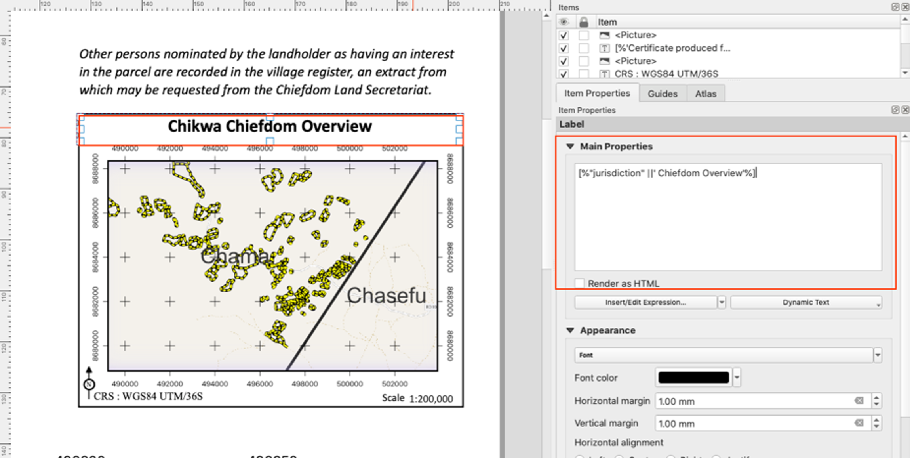
- For the map itself, go back to the main QGIS window and zoom out or in to include all of the parcels within the chiefdom. Make sure the chiefdoms are labelled in the main window. Then use the 'Add Map' tool back in the print layout window and set the scale to 200,0000.


- In the item properties panel for the Chiefdom map, click the checkbox next to 'Controlled by Atlas', and in the dropdown select 'Fixed scale'.

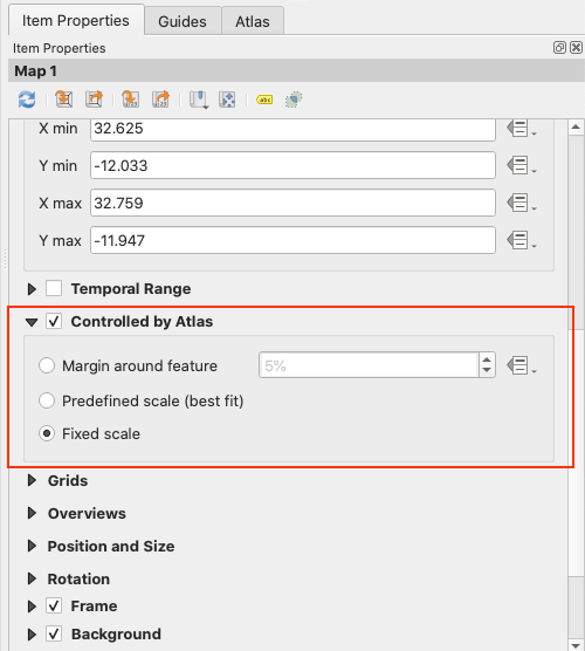
- To set up the grid background on the chiefdom map, first make sure the chiefdom map is selected. Then go to 'Item Properties' > 'Grid', then add a grid by clicking on the green plus sign. A new grid name will pop up, select the new grid and then click ‘Modify Grid…’.

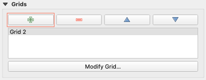
- A new panel will replace the previous one where you can set the following grid attributes:
    - Grid type: Cross
    - CRS: EPSG:32736
    - Interval: Map Units
    - Cross width: 1.00 mm
    - Frame style: Exterior Ticks
    - Frame size: 1.00 mm
    - Frame margin: 0.00 mm
    - Frame line thickness: 0.10 mm

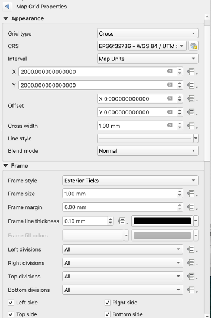

### Parcel Map
- Use the 'Add Label' tool to for the title. Use the expression: ``` [%'Parcel Number: '|| upper( "parcel") || ' Area: '||format_number( "area_hectares" /1,2)||' Ha'%] ```
    - example output: Parcel Number: CHI7009 Area: 1.30 Ha

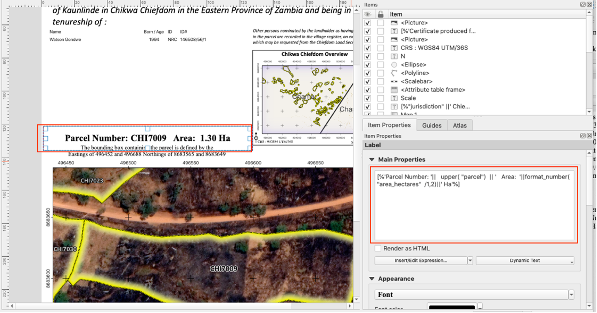
- Use the 'Add label' tool again for the subtitle. Use the expression: ``` [%'The bounding box containing the parcel is defined by the Eastings of '||CEIL( "x_min" ) || ' and ' || CEIL( "x_max" ) ||' Northings of '||CEIL(  "y_min" )|| ' and ' || CEIL( "y_max" ) %] ```
    - example output: The bounding box containing the parcel is defined by the Eastings of 496452 and 496688 Northings of 8683565 and 8683649
- Use the 'Add Map' tool and click and drag so the map covers the bottom half of the print layout, set the scale. Make sure that you have parcels labelled in the main QGIS window, otherwiser they won't appear in the map.
    - In the item properties panel for the Chiefdom map, click the checkbox next to 'Controlled by Atlas', and in the dropdown, set 'Margin around feature' to 10%
- Then select the same grid you created for the chiefdom map, with the same attribute settings.

### Footer
- Use the 'Add Label' tool to create the signature with the expression: ``` [%'Signed ..........................................
'
||'His Royal Highness ' ||'Chief '||  "jurisdiction" %] ```
- Use the 'Add Scale Bar' tool, click and drag the scale bar until it takes up about 1/3 the width of the parcel map.
    - Set the following properties:
        - Style: Line Ticks Middle
        - Scalebar units: Meter

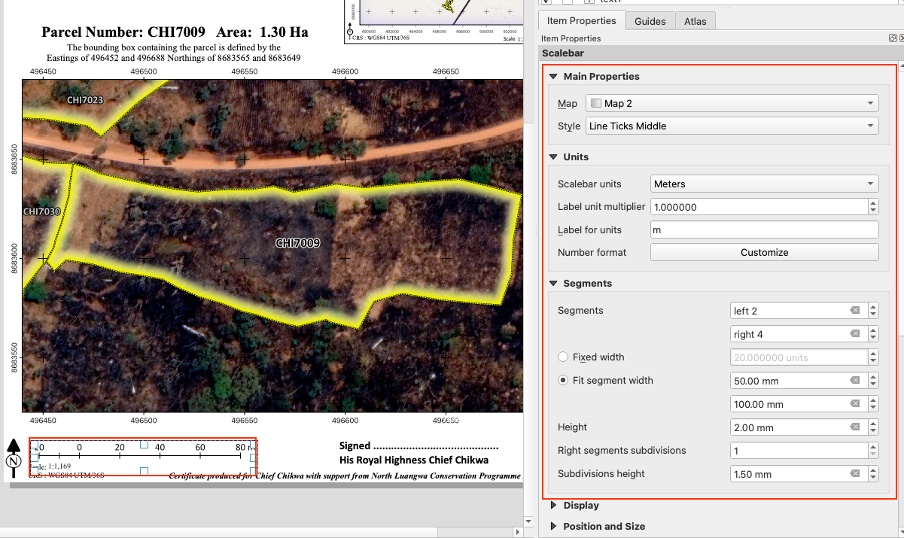

- Use the 'Add Label' tool for the text on the bottom right with the expression ``` [%'Certificate produced for '||'Chief '||"jurisdiction" ||' with support from North Luangwa Conservation Programme '|| format_date( now(),'dd-MM-yyyy')%] ```
    - Example output: Certificate produced for Chief Chikwa with support from North Luangwa Conservation Programme 29-11-2022


Each certificate also comes paired with an [annex](Annex_Production.html) which includes information on all the rightsholders and persons of interest associated with the parcel.

**[Previous](Certificate_Production.html) <> [Next](Annex_Production.html)**
