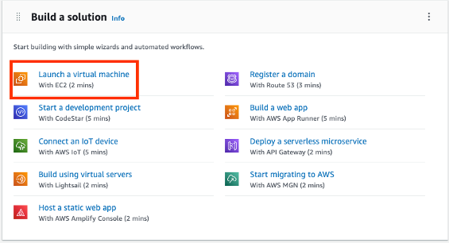
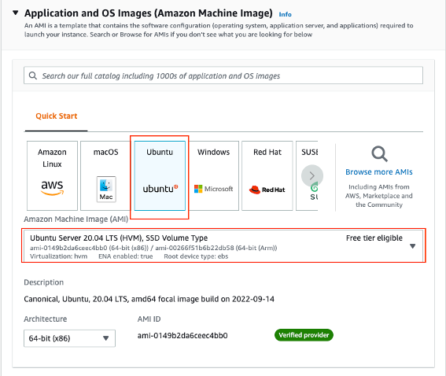
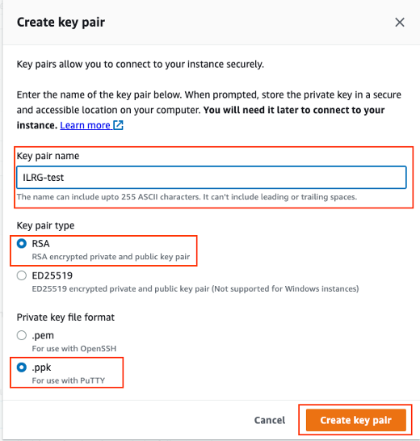
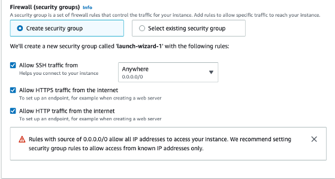
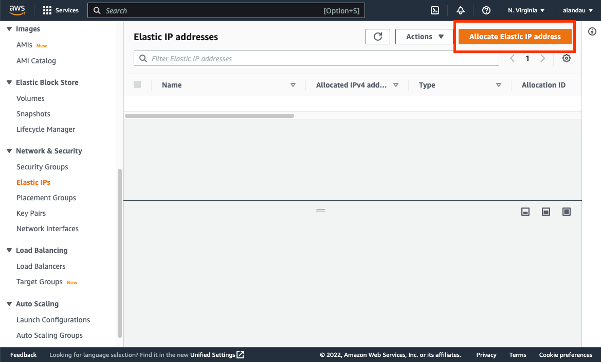
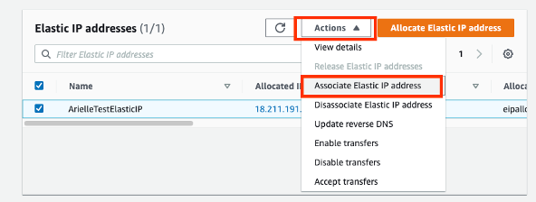
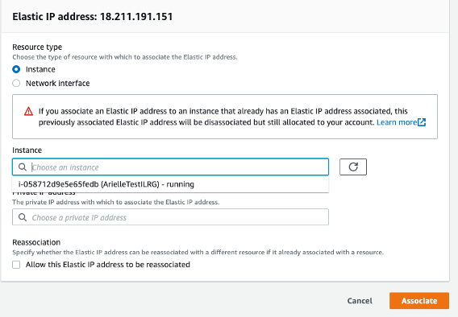

# Setting Up an Amazon EC2 Instance

Setting up an EC2 instance on Amazon Web Services (AWS) is a prerequisite for [setting up ODK Central](ODK_Central_Setup.html). We run the ILRG project on an EC2 instance because it acts as a virtual machine, and allows us to host all postgres databases, ODK Central, media files, etc. all in the same instance.

## Create an AWS Account
- Go to the [AWS Homepage](https://aws.amazon.com/), then follow sign up instructions by clicking on 'Create an AWS Account' in the top right corner
    - Choose basic support for now, you can always update later on
    - If you are an IAM user for an account, or you already have an account as a root user, [sign in](https://console.aws.amazon.com/console/home?nc2=h_ct&src=header-signin)
- Once you have signed in, on the Management Console hompage under the 'Build a Solution' section, choose to 'Launch a Virtual Machine With EC2'

## Launch Virtual Machine With EC2

- Name your server, it should have a name relevant to your project, like 'ILRG Zambia'
- Choose Ubuntu Server 20.04, we use this server because it is most compatible with ODK Central

- Choose the instance type based on the amount of storage you think you will need
    - It is recommended that servers have at least 8 GB of memory, the current ILRG project uses a t3.large instance type
    - The t2.micro instance (free tier eligible) instance type has 1 GB of memory, and is recommended if you expect only a small number of form submissions and no large media attachments

- Create a key-pair login and name the key pair (the name should be similar to your database name)
    - Choose the RSA key pair type
    - If you have a mac choose the .pem format, if you have any other system choose the .ppk format
    - Then click 'Create key pair'

- In security settings: open up ports for SSH, HTTP and HTTPS

- You can leave the other options as the default, then click 'Launch Instance'
- **Make sure you save your key pair in a place where it will not be deleted, and write down where you saved it**

## Allocate and Associate IP Address
- After launching, go to the 'Elastic IP's' menu under Network & Security. Then click on 'Allocate Elastic IP Address'

- Associate the Elastic IP address you just created with the EC2 instance created in the last Step
    - Click on the Elastic IP you just allocated, then click on 'Actions' > 'Associate Elastic IP Address'

- Choose the instance you created in the last step, in this example, the EC2 instance is named ArielleTestILRG. Click on the instance, and then click 'Associate'

Write down your IP address as you will need it when you register a domain. The next step is to install PuTTY so we can log into our server. Then we will register a domain and install ODK Central on the EC2 instance.

**[Previous](Server_Setup.html) <> [Next](PuTTY_Setup.html)**
