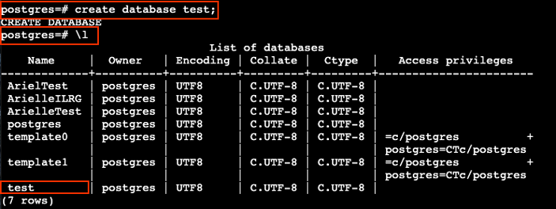
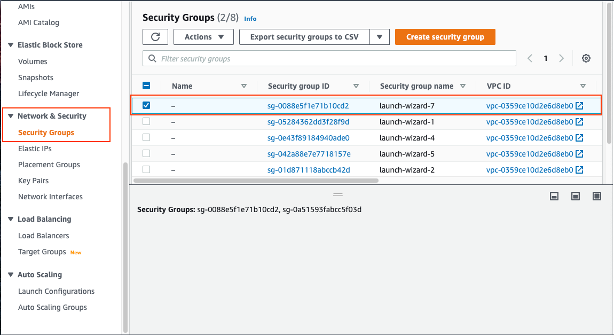
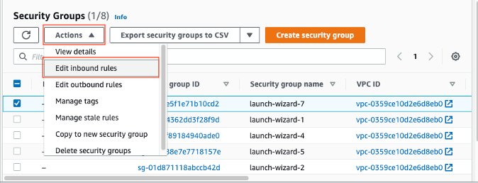
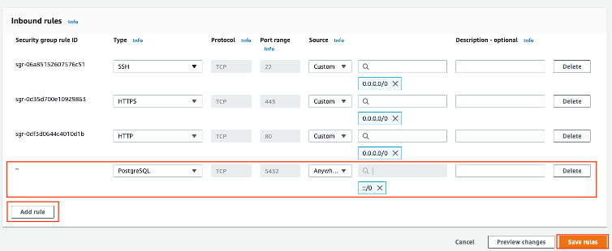

# Setting Up PostgreSQL Databases
We installed ODK Central on an AWS based Ubuntu server in a previous step. In this step, we will create and configure the postgres database, used to manage all of the data on the same EC2 instance. This database will contain two schemas: public and update.

## Connect to the Server
See the beginning of the [Webmnin Set Up Instructions](Webmin_Setup.html) for instructions on how to connect to the server.

## Install PostgreSQL
- After successfully logging into the server, run the package update and then install the postgres package:

    ```
    sudo apt update

    sudo apt install postgresql postgresql-contrib
    ```

    - Hit `Y` to confirm changes when prompted
- Upgrade packages

    ```
    sudo apt upgrade
    ```
- Validate the service:
```
sudo service postgresql status
```
- Connect to the server:
```
sudo -u postgres psql
```
    - You should see the command line now start with `postgres=#`
- Quit the server to return to the command line
```
\q
```

## Configure PostgreSQL and Install PostGIS
- By default, postgres only allows connections from the localhost, but we require work to be done by remote machines, so we will configure users to log in to postgres from anywhere with a password. We have to edit the `postgresql.conf` file to do this.
- First navigate in the terminal command line to where the `postgresql.conf` file is, listed below is the file path when PostgreSQL is installed on Amazon EC2. You might need to change the 12 to another number based on the version of postgresql that you installed.
```
cd /etc/postgresql/12/main/
```
- Open and edit the `postgresql.conf` file:
```
sudo nano postgresql.conf
```
    - Under connection settings (near the top of the file) change `listen_addresses = 'localhost'` to `listen_addresses = '*'`
    - If there is a `#` before listen_addresses, make sure to delete it or the command will remain a comment and not do anything
    - Exit the GUI by hitting `CTRL + X` then hit `Y` to save your changes. Then hit enter to confirm the file name.
- Open and edit the table in `pg_hba.conf`
```
sudo nano pg_hba.conf
```
    Change the table at the bottom to the following, leave everything else the same:
    ```
    # Database administrative login by Unix domain socket
    local   all             postgres                             trust

    # "local" is for Unix domain socket connections only
    local   all             all                                  trust

    # IPv4 local connections:
    host    all             all             0.0.0.0/0            trust

    ```
    - Exit the GUI by hitting `CTRL + X` then hit `Y` to save your changes. Then hit enter to confirm the file name.
- Navigate back to the root folder:
```
cd -
```
- Restart postgresql for the changes to take effect:
```
sudo systemctl restart postgresql
```
- Install postgis
```
sudo apt update
sudo apt upgrade
sudo apt install postgis postgresql-12-postgis-3
```

## Create User
- You should still be logged onto the server. Then connect to the postgres server:
```
sudo -u postgres psql
```
    - You should see the command line now start with `postgres=#`
- Create a user, and then alter their role to make the user a superuser with create database and create role privileges
    ```
    create user username with login password 'usernamepassword';

    alter role username with superuser createdb createrole;
    ```

    - for example:
        ```
        create user derek2 with login password 'derek2password';

        alter role derek2 with superuser createdb createrole;
        ```

## Create Database
- Use the createdb commmand to create a PostgreSQL database, you cane it waht you like, in this example it is named 'test'. You should still be logged into postgres, so the command line should start with `postgres=#`
```
create database test;
```
- Check that the database was created with the following command. You should see a list of databases.
```
\l
```
- for example:
    
- log into the new database and create postgis extension
    - First, exit the postgres command line, so you can log into the new database instance
    ```
    \q
    ```
    - Log into the database just created
    ```
    psql databasename postgres
    ```
    ex:
    ```
    psql test postgres
    ```
    - The command line should now start with `databasename=#`, ex: `test=#`
- Create postgis extension:
```
CREATE EXTENSION postgis;
```
    - You should see the output message `CREATE EXTENSION`
- You can quit the database now:
```
\q
```

## Configure Authentication
- Authentication is required to run schema building scripts remotely. You need to know your hostname (in this case use the DB instance endpoint, the IP address of the EC2 instance), port, database name, username and password
```
echo host:port:database:user:password > .pgpass
chmod 600 .pgpass
```
ex:
```
echo 13.254.91.45:5432:test:derek:derekpassword > .pgpass
chmod 600 .pgpass
```

## Open Ports on AWS
- This will be a similar process to when you opened ports for [Webmin](Webmin_Setup.html)
- Under the EC2 instance on AWS, click on the ‘Security’ tab, and note the name of the Security group

    
- Navigate on the side panel to 'Network & Security' > 'Security Groups'
- Click the check box for the security group that is the same as the one for your EC2 instance

- Click on 'Actions' > 'Edit inbound rules'

- Click 'Add Rule' with 'Type' Postgresql, 'Port range' 5432, 'Source' Anywhere IPV6 ::/0, then hit 'Save rules'


Next you must set up and connect to PGAdmin in order to run the schema building scripts.

**[Previous](NavigatingWebmin.html)** <> **[Next](PGAdmin.html)**
