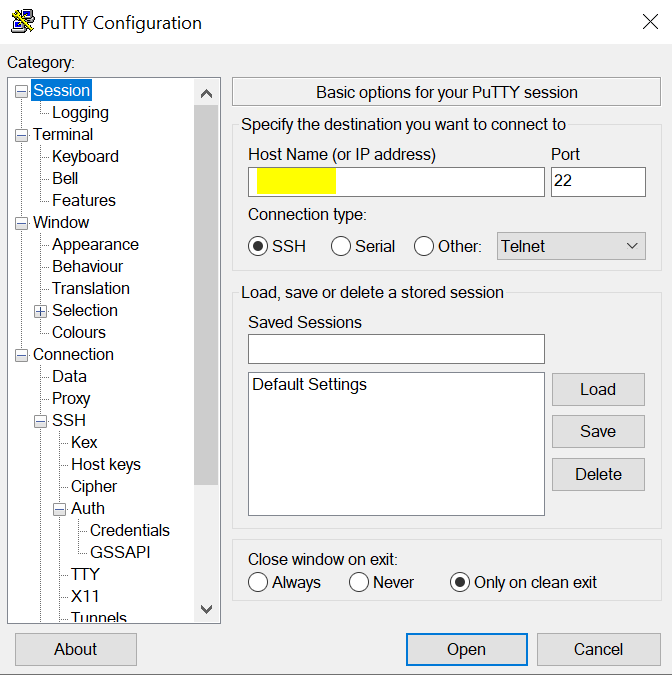

# Connecting to the Server
The required services, including ODK Central, Webmin, and PostgreSQL will now be installed onto our server instance. This will be done through the command line. The easiest way to connect is by using PuTTY, but other methods are also shown below. 

## Installing PuTTY
PuTTY is a free and open-source terminal emulator, serial console and network file transfer application. To make managing all the data files and databases easier. We use PuTTY for any software installations and for any server configurations. We will need to use PuTTY later on to [log onto the server to install Webmin](/Pages/Server/Webmin_Setup.html).

[Putty for MacOS](https://www.ssh.com/academy/ssh/putty/mac)

[Putty for Windows](https://www.putty.org/)

It is recommended to install PuTTY using [Homebrew](https://brew.sh/):
- In the command line of your computer:
```
brew install putty
```
## Log into Server via PuTTY GUI



## Log into Server via Terminal Command Line
- First navigate in your terminal to the folder where you stored your .ppk or .pem file using ```cd``` commands
    - For example, if your .ppk or .pem key is in your downloads folder, type this into the terminal: ```cd Downloads```, if the key is in a folder on your desktop: ```cd Desktop/folder1/folder2```
- To log in use the following command, it is likely that your username is ubuntu: 
```
ssh -i puttyCode.ppk user@hostname
```
    - Example: 
    ```
    ssh -i ilrg_server_2.pem ubuntu@13.244.91.45
    ```

- If you get an error like this: `Permissions 0644 for 'documentation.pem' are too open.
It is required that your private key files are NOT accessible by others.
This private key will be ignored.` try using the `chmod 400` command to modify permissions of the .pem or .ppk key
    ```
    chmod 400 fileName.pem
    ```
    - Example: 
    ```
    chmod 400 AriellePostgresTest.pem
    ```
- Then try to log in again with ssh


**[Previous](AWS_Setup.html) <> [Next](ODK_Central_Setup.html)**
