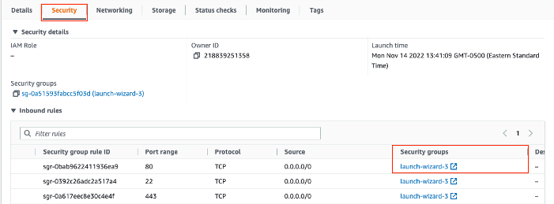

# Instructions for Setting up Webmin

## Connect to the Server
See the [Connecting to the Server](PuTTY_Setup.html) page for instructions on how to connect to the server.

## Install Webmin
- Update and upgrade packages
```
sudo apt update
sudo apt upgrade
```
    
    - Type `Y` when asked if you want to continue
- Install dependency packages:
```
sudo apt install software-properties-common apt-transport-https
```
    
    - Type `Y` when asked if you want to continue
- Download the Webmin PGP key with wget and add it to your system's set of keys
```
wget -q -O- http://www.webmin.com/jcameron-key.asc | sudo apt-key add -
```
    
    - You should see a message: `OK`
- Manually add the Webmin repository:
```
sudo add-apt-repository "deb [arch=amd64] http://download.webmin.com/download/repository sarge contrib"
```
- Start the Webmin application:
```
sudo apt install webmin
```
    
    - Type `Y` when asked if you want to continue
- Important: In the next step you will enable the firewall. Do not close out of your terminal before disabling it! You may be unable to get back in if the firewall is enabled. There will also be a warning telling you that you may lose connections; this is okay, just be sure not to close the terminal window.
- Configure the firewall and then reload it for the changes to take effect
```
sudo ufw enable
sudo ufw allow 10000/tcp
sudo ufw reload
```
- Check the status of the firewall to confirm changes, you want the line with `10000/tcp (v6) to allow from anywhere`
```
sudo ufw status
```
- Disable the firewall so you can continue to access the server command line (keeping the firewall active disables ssh):
```
sudo ufw disable
```
- It is now safe to close the terminal window.
- For the following command, be careful. Do not copy and paste this command directly. You must edit in your desired password. It is suggested to use a text editor to do this; copy in this command, replace the text that is displayed in capital letters with your desired password, then copy and paste that into your terminal.
- Set admin password:
```
sudo /usr/share/webmin/changepass.pl /etc/webmin root YOURPASSWORD
```

## Configure AWS For Webmin
- We need to edit the security groups for the EC2 instance so that Webmin can communicate with the server
- Navigate to the EC2 instance on AWS, then click on the 'Security' tab and note the security group, in this example, the security group is launch-wizard-3


- Then in the left panel, navigate to 'Security Groups' under 'Network & Security'. Then click the check box on the Security Group for your instance


- Click on 'Actions' and then 'Edit Inbound rules'


- Click 'Add rule' and fill out a new role with type 'Custom TCP', Port range 10000, Source 'Anywhere' 0.0.0.0/0. Then hit 'Save rules'.


- You should be able to visit your Webmin page through the web using the server's IP: https://[your server's IP]:10000/
    - to login, use the username ubuntu and the admin password you set for the server earlier on
-The Webmin home page should look something like this:


**[Previous](Webmin.html)** <> **[Next](NavigatingWebmin.html)**
