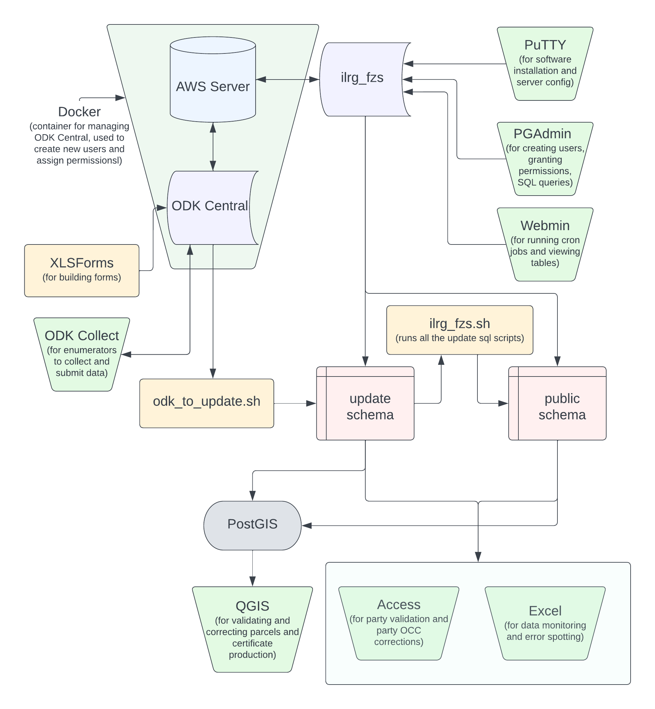

# Integrated Land and Resource Governance
## Complete Tech Documentation and Project Guide

Welcome to the documentation for the Integrated Land and Resource Governance (ILRG) customary land documentation process. This process was developed as an extension of the [Mobile Applications to Secure Tenure (MAST)](https://www.land-links.org/tool-resource/mapping-approaches-for-securing-tenure-mast-learning-platform/) approach to land technology, a USAID project.

The image below provides an overview of all the different tech components (including software, servers and batch scripts) used to run the ILRG customary land documentation process as of January 2023. 

The system as a whole is hosted on an Amazon EC2 server instance, running Ubuntu. Data is collected through Open Data Kit and then cleaned through a batch of SQL scripts and moved onto the update schema. Data is then validated in Access and QGIS. Once validated, the data moves to the public schema. After validation, a draft land certificate is produced in QGIS. 

The data then moves through a similar process of Objection, Correction and Confirmation (OCC). Any OCC changes are collected in ODK, cleaned and put in the update schema, changes are made and validated in Access and QGIS, and the data is moved onto the public schema. Finally, official certificates are produced in QGIS. In sum, the data moves through a system of entry, cleaning and validation twice. 

This site serves as an instruction manual and documentation to set up an identical system as well as navigate the current system. Use the left panel as a table of contents, starting at [Server](Pages/Server/Server_Setup.html) and ending at [Objection, Correction and Confirmation](Pages/OCC/OCC.html).

Documentation by [Arielle Landau](https://alandaux.github.io/), GIS and Data Analysis Consultant at Tetra Tech ARD

**[Next](Pages/Server/Server_Setup.html)**

<!---

This is a *bare-minimum* template to create a Jekyll site that uses the [Just the Docs] theme. You can easily set the created site to be published on [GitHub Pages] – the [README] file explains how to do that, along with other details.

If [Jekyll] is installed on your computer, you can also build and preview the created site *locally*. This lets you test changes before committing them, and avoids waiting for GitHub Pages.[^1] And you will be able to deploy your local build to a different platform than GitHub Pages.

More specifically, the created site:

- uses a gem-based approach, i.e. uses a `Gemfile` and loads the `just-the-docs` gem
- uses the [GitHub Pages / Actions workflow] to build and publish the site on GitHub Pages

Other than that, you're free to customize sites that you create with this template, however you like. You can easily change the versions of `just-the-docs` and Jekyll it uses, as well as adding further plugins.

[Browse our documentation][Just the Docs] to learn more about how to use this theme.

To get started with creating a site, just click "[use this template]"!

----

[^1]: [It can take up to 10 minutes for changes to your site to publish after you push the changes to GitHub](https://docs.github.com/en/pages/setting-up-a-github-pages-site-with-jekyll/creating-a-github-pages-site-with-jekyll#creating-your-site).

[Just the Docs]: https://just-the-docs.github.io/just-the-docs/
[GitHub Pages]: https://docs.github.com/en/pages
[README]: https://github.com/just-the-docs/just-the-docs-template/blob/main/README.md
[Jekyll]: https://jekyllrb.com
[GitHub Pages / Actions workflow]: https://github.blog/changelog/2022-07-27-github-pages-custom-github-actions-workflows-beta/
[use this template]: https://github.com/just-the-docs/just-the-docs-template/generate
--->
